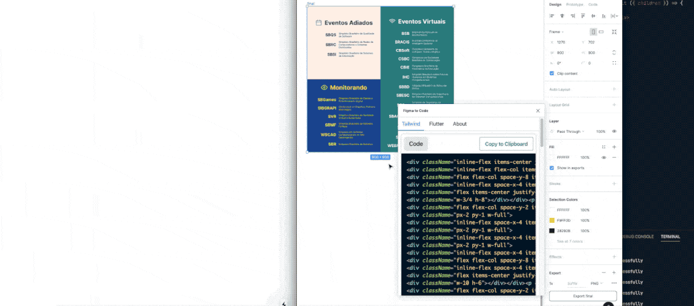
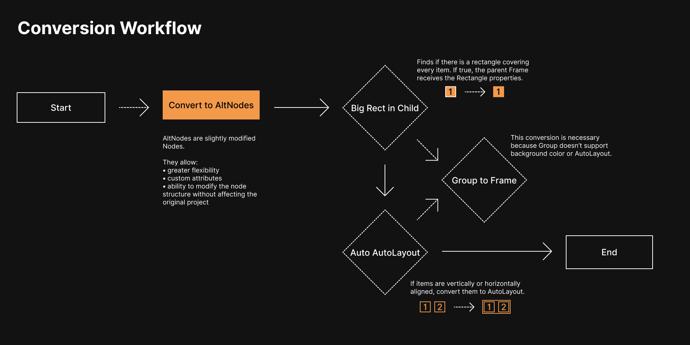
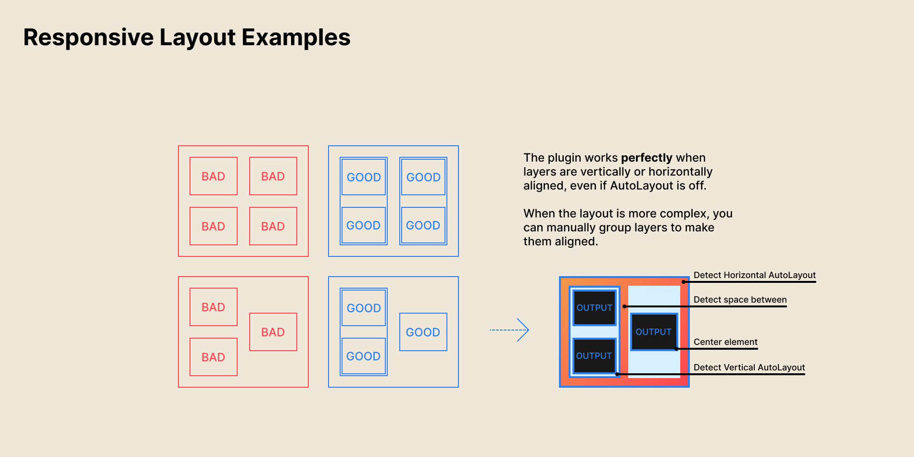

<!-- 

 -->

# Figma to Code

Most _design to code_ plugins are bad, some are even paid. This project aims to raise the bar by generating **responsive** layouts in [Tailwind](https://tailwindcss.com/), [Flutter](https://flutter.github.io/) and [SwiftUI](https://developer.apple.com/xcode/swiftui/). The plan is to eventually add support for [Jetpack Compose](https://developer.android.com/jetpack/compose) and possibly standard HTML or other frameworks like [React Native](https://reactnative.dev/), [Bootstrap](https://getbootstrap.com/) or [Fluent](https://www.microsoft.com/design/fluent/). Feedback, ideas and partnerships are appreciated!

## How it works

This plugin takes an unconventional approach to improve code quality: it optimizes the layout before the conversion to code even begins. The standard Figma [Nodes](https://www.figma.com/plugin-docs/api/nodes/) (what represents each layer) is a joy to work with, but it can't modify a layer without modifying the user project. For this reason, I decided to virtualize it, remaking the official implementation and naming them `AltNodes`. During the process of converting a `Node` into an `AltNode`, the plugin does the following:

That process can also be seen as an [Intermediate Representation](https://en.wikipedia.org/wiki/Intermediate_representation) and might allow this plugin to, one day, live outside Figma.

## Hard cases

When finding the unknown (a `Group` or `Frame` with more than one child and no vertical or horizontal alignment), Tailwind mode uses [insets](https://tailwindcss.com/docs/top-right-bottom-left/#app) for best cases and `left`, `top` from standard CSS for the worst cases. Flutter mode uses `Stack` and `Positioned.fill`. Both are usually not recommended and can easily defeat the responsiveness. In many scenarios, just wrapping some elements in a `Group` or `Frame` can solve:

**Tip**: Instead of selecting the whole page, you can also select individual items. This can be useful for both debugging and componentization. For example: you can use the plugin to generate the code of a single element and then replicate it using a for-loop.

### Todo

- Vectors (tricky in HTML, unsupported in Flutter)
- Images (they are local, how to support them?)
- Line/Star/Polygon (todo. Rectangle and Ellipse were prioritized and are more common)
- The source code is fully commented and there are more than 30 "todo"s there

### Tailwind limitations

- **Width:** Tailwind has a maximum width of 384px. If an item passes this, the width will be set to `w-full` (unless it is already relative like `w-1/2`, `w-1/3`, etc). This is usually a feature, but be careful: if most layers in your project are larger than 384px, the plugin's result might be less than optimal.

### Flutter limits and ideas

- **Stack:** in some simpler cases, a `Stack` could be replaced with a `Container` and a `BoxDecoration`. Discover those cases and optimize them.
- **Material Styles**: text could be matched to existing Material styles (like outputting `Headline6` when text size is 20).
- **Identify Buttons**: the plugin could identify specific buttons and output them instead of always using `Container` or `Material`.

## How to build the project

### Package Manager

The project is configured for [pnpm](https://pnpm.io/). To install, see the [installation notes for pnpm](https://pnpm.io/installation).

### Monorepo

The plugin is organized as a monorepo. There are several packages:

- `packages/backend` - Contains the business logic that reads the Figma API and converts nodes
- `packages/plugin-ui` - Contains the common UI for the plugin
- `packages/eslint-config-custom` - Config file for ESLint
- `packages/tsconfig` - Collection of TSConfig files used throughout the project

- `apps/plugin` - This is the actual plugin assembled from the parts in `backend` & `plugin-ui`. Within this folder it's divided between:
  - `plugin-src` - loads from `backend` and compiles to `code.js`
  - `ui-src` - loads the common `plugin-ui` and compiles to `index.html`
- `apps/debug` - This is a debug mode plugin that is a more convenient way to see all the UI elements.

The plugin is built using Turbo which in turn builds the internal packages.

#### Commands

`pnpm run ...`

- `dev` - runs the app in dev mode. This can be run in the Figma editor.
- `build`
- `build:watch`
- `lint`
- `format` - formats with prettier (warning: may edit files!)

#### Debug mode

When running the `dev` task, you can open `http://localhost:3000` to see the debug version of the UI.

## Issues

The Figma file for this README and icon is also open and welcome to changes! [Check it here.](https://www.figma.com/file/8buWpm6Mpq4yK9MhbkcdJB/Figma-to-Code)

I took decisions thinking about how it would benefit the majority of people, but I can (and probably will!) be wrong many times. Found a bug? Have an idea for an improvement? Feel free to [add an issue](../../issues) or email me. Pull requests are also more than welcome.
