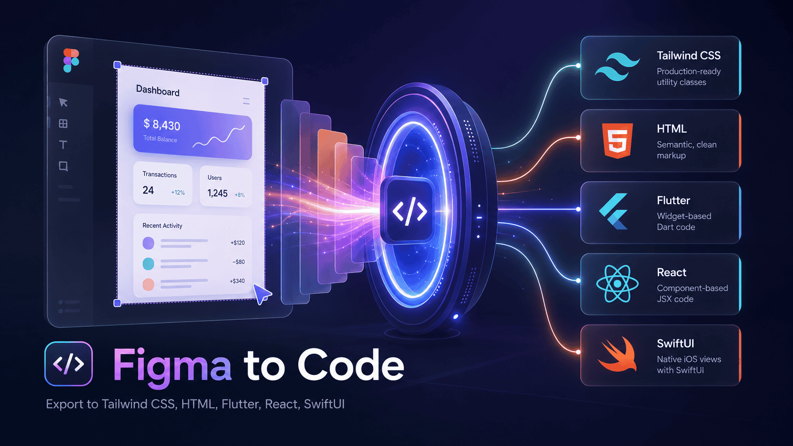

[](https://figma-to-code-plugin.vercel.app/)

<h1 align="center">Figma to Code</h1>

<p align="center">
  <strong>Fast, flexible Figma-to-code conversion. Private by design.</strong>
</p>

<p align="center">
  Generate editable HTML, React, Svelte, Tailwind, Flutter, and SwiftUI from a Figma selection—without an account, generation credits, or design uploads.
</p>

<p align="center">
  <a href="https://www.figma.com/community/plugin/842128343887142055"><strong>Install the free plugin</strong></a>
  ·
  <a href="https://figma-to-code-plugin.vercel.app"><strong>Explore the website</strong></a>
</p>

## Why this plugin exists

Figma to Code is for the moment between a visual design and a real implementation. Select a frame, component, or smaller group of layers and get a readable visual scaffold that you can copy, refine, or download as a starter project.

The generator is deterministic and runs inside Figma's plugin sandbox. It does not call an AI model, inspect a repository, or send the selection to another service. That makes it useful for quick handoffs as well as teams where external design processing is not allowed.

- **Free and open source** — no account, trial, credits, or generation limits.
- **Private by architecture** — the published plugin configuration allows no network domains and requests no permissions.
- **Works in Design and Dev Mode** — run the regular plugin or use it as a Dev Mode code generator.
- **Web and native targets** — generate several output shapes from the same selection.
- **Flexible, inspectable output** — tune framework-specific settings, preview the result, copy the code, or download a starter project.
- **Warnings instead of silent guesses** — target-specific gaps are surfaced in the interface.

## Output targets

| Target       | Available output modes                                      |
| ------------ | ----------------------------------------------------------- |
| HTML         | HTML, React (JSX), Svelte, styled-components                |
| Tailwind CSS | HTML, React (JSX), Twig; supports Tailwind 3 and Tailwind 4 |
| Flutter      | Full app, stateless widget, or snippet                      |
| SwiftUI      | Preview, `View` struct, or snippet                          |

The plugin can also package generated code and local image assets into downloadable starters:

- Web: Vite, Next.js, or static HTML
- Flutter: source, `pubspec.yaml`, assets, and setup instructions
- SwiftUI: source, asset catalog, and setup instructions

These exports are deliberately small and dependency-light. They are starting points, not generated production applications.

## What you can tune

Options appear only when they apply to the selected target:

- Include Figma layer names in generated classes.
- Keep exact values or round spacing and colors to nearby Tailwind tokens.
- Generate Tailwind 4 syntax and add a custom class prefix.
- Use Figma color variables in supported output.
- Embed images as Base64 in HTML.
- Embed supported vector shapes as SVG for web output.
- Switch between framework-specific file, component, and snippet modes.

The interface also includes a visual preview, light and dark preview backgrounds, conversion warnings, extracted colors and gradients, code copying, and project downloads.

## How to use it

1. [Install Figma to Code from the Figma Community](https://www.figma.com/community/plugin/842128343887142055).
2. Select a frame, component, group, or individual layer.
3. Run the plugin in Figma Design, or choose one of its codegen outputs in Dev Mode.
4. Pick a target and adjust the relevant options.
5. Review the preview and warnings, then copy the code or download a starter project.

Smaller selections usually create better component boundaries. Instead of converting an entire page at once, try generating one reusable section or control and integrate it into your application yourself.

## Privacy model

The repository-level [`manifest.json`](manifest.json) is the configuration Figma uses for the published plugin. It contains the following enforceable boundary:

```json
{
  "permissions": [],
  "networkAccess": {
    "allowedDomains": ["none"]
  }
}
```

The selected nodes are read through Figma's Plugin API, normalized in memory, converted by framework-specific TypeScript code, and returned to the plugin interface. There is no telemetry, design upload, external model, or separate user account.

This claim is intentionally narrow: Figma itself is a connected product and handles your files according to your Figma plan and policies. This plugin does not add another network destination for the selected design data. See the [privacy architecture](https://figma-to-code-plugin.vercel.app/privacy) for more detail.

## What it handles well

- Auto Layout, nested frames, groups, alignment, sizing, and stacking
- Mixed flow and absolute positioning
- Typography, fills, borders, corner radii, and many effects
- Color variables and several gradient types
- Images and local asset export
- Responsive visual scaffolds across web and native targets

## Deliberate limitations

A Figma document describes visual structure; it does not contain the full intent of an application. Treat the result as editable starter code and review it before shipping.

- **No AI inference.** The plugin does not invent semantics, interactions, or prompt-based redesigns.
- **No codebase connection.** It cannot inspect a repository, map existing components, import an application into Figma, synchronize generated files, or push later design changes into your code.
- **No application logic.** It cannot infer state management, data loading, navigation, backend behavior, or business rules.
- **No invented accessibility.** Semantics, labels, keyboard behavior, dynamic type, and responsive breakpoints still need human review.
- **Some details are target-dependent.** Vector support is optional for web and limited in native targets; stars, polygons, lines, gradients, and effects do not always have equivalent APIs.
- **Large selections cost more memory.** Images and complex layer trees take longer to process; focused selections are more reliable.

When a detail cannot translate cleanly, the plugin reports a warning rather than pretending the result is exact.

## How conversion works

The generator behaves more like a small compiler than a screenshot-to-code service:

1. **Read** — inspect the selected Figma nodes and their layout and style metadata.
2. **Normalize** — convert them into an internal tree that can be transformed without modifying the source document.
3. **Optimize** — resolve parent-child relationships, Auto Layout, alignment, sizing, and positioning.
4. **Generate** — send the normalized tree to the selected HTML, Tailwind, Flutter, or SwiftUI backend.
5. **Explain** — return the code, preview data, extracted assets, and conversion warnings to the UI.

Because the rules are public TypeScript, the conversion can be inspected, tested, and improved without depending on a hosted API.

## Local development

### Requirements

- Node.js 24 or newer
- pnpm 11

Install the workspace from the repository root:

```sh
pnpm install
```

Run the plugin watchers and the product website together:

```sh
pnpm dev
```

The website will be available at <http://localhost:3000>. To work only on the Figma plugin:

```sh
pnpm --filter plugin dev
```

Then open Figma and use **Plugins → Development → Import plugin from manifest**, selecting this repository's `manifest.json`.

### Useful commands

```sh
pnpm build          # Build every package and app
pnpm lint           # Run Oxlint
pnpm test           # Run the automated tests
pnpm format         # Format with Oxfmt
pnpm format:check   # Check formatting without writing
```

### Repository structure

| Path                 | Purpose                                                                                  |
| -------------------- | ---------------------------------------------------------------------------------------- |
| `packages/backend`   | Figma node processing, intermediate representation, code generators, and project exports |
| `packages/plugin-ui` | Shared React interface used by the plugin and interactive website demo                   |
| `packages/types`     | Shared settings, message, preview, and output types                                      |
| `packages/tsconfig`  | Shared TypeScript configuration                                                          |
| `apps/plugin`        | Figma controller and UI entry points; builds `code.js` and `index.html`                  |
| `apps/web`           | Public website, interactive preview, privacy page, and comparison guides                 |

## Contributing and support

Focused pull requests, new fixtures, and improvements to existing generators are welcome.

- [Try the interactive preview](https://figma-to-code-plugin.vercel.app/#preview)
- [Review the GPL-3.0 license](LICENSE)

If generated output is incorrect, a small reproducible Figma selection and the target/options used are especially helpful.
