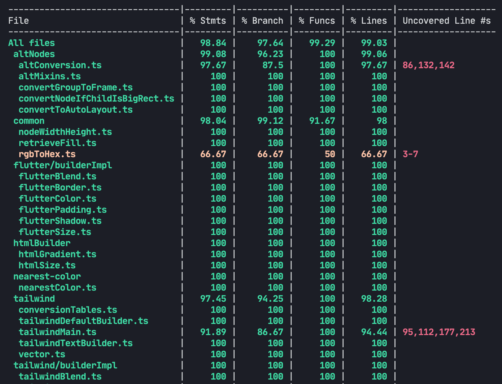

# Tests

This project uses [Jest](https://jestjs.io/) for tests, and has some help from [Figma API Stub](https://github.com/react-figma/figma-api-stub), since the official Figma Plugins API is untestable.

## Coverage

Coverage is currently at an impressive 99%. You can inspect the coverage by clicking at the Codecov badge:

## Test commands

- To run the tests: `yarn test` or `yarn run test`
- To calculate the coverage: `yarn run coverage`
- To run ES Lint: `yarn run lint`
